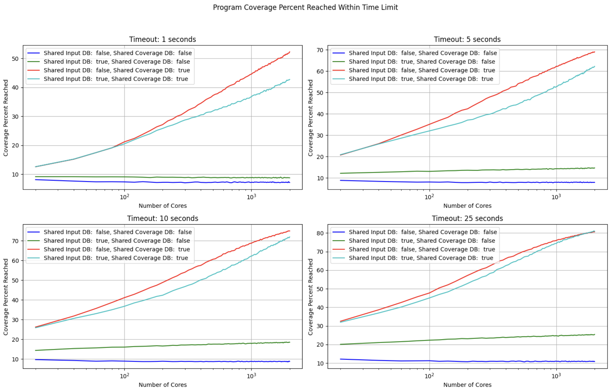

# Ultimecia: A fuzz testing theory research tool

## Introduction

This tool is designed for understanding the behavior of fast fuzzers at different configurations

We run experiments using increasing numbers of cores, configurable timeouts, input DB sharing, and coverage DB sharing on randomly-generated, highly-branching Rust programs.

The fuzzer allows us to explore the impact of linear core scaling and effectiveness of mutator strategy aggressiveness on coverage in a pure Rust context.



## Requirements

- Rust 1.74.0
- Python 3

## Features

- **Coverage analysis with timeouts:** Analyzes fuzzer configurations at different timeouts to understand the tradeoffs between them
- **Linear core scaling analysis:** Understands the impact of increasing core count on time to reach full coverage
- **Mutator strategy impact:** Examines how different levels of mutation aggressiveness affect coverage reached by fuzz case count

## Usage

1. **Coverage Reached with Timeout Analysis**
   - Results saved to `notebooks/coverage_reached_with_timeout.csv`.
   - Execute `perform_fuzzer_analysis` with specified timeouts.

2. **Time to Full Coverage Analysis**
   - Results are recorded in `notebooks/times_to_full_coverage.csv`.
   - Run with no timeout to determine time to reach full coverage for various core counts.

3. **Mutation Aggressiveness Experiment**
   - Data output to `notebooks/mutation_aggressiveness.csv`.
   - Tests different mutation aggressiveness percentages on a single core.

## Code Structure

- `program_gen`: Tool to generate highly branching, traced Rust programs for our fuzzer to execute
- `fuzz_harness`: A module containing the core fuzzing logic and configurations.
- `analysis`: The main entry point for the tool, handling different analysis functions.
- `notebooks`: The main entry point for the tool, handling different analysis functions.

### Program Generation

```
cargo run --release --bin program_gen
```

The fuzzer operates over a single Rust function with the following type-signature:

```rust
pub fn fuzzable_function(input: &[u8; N], covered_code_blocks: &mut [u64; M]) -> bool {
    // Function logic...
}
```

The `program_gen` crate in the workspace generates highly-branching, random versions of this function that have coverage tracing enabled for the fuzzer. The results look something like this:

```rust
pub fn fuzzable_function(input: &[u8; N], covered_code_blocks: &mut [u64; M]) -> bool {
    let mut new_block_reached = false;
    if covered_code_blocks[0] == 0 { new_block_reached = true; }
    covered_code_blocks[0] = 1;
    if input[122] & 0b00111100 == 0b00011100 {
        if covered_code_blocks[1] == 0 { new_block_reached = true; }
        covered_code_blocks[1] = 1;
        if input[62] & 0b11100000 == 0b00100000 {
            if covered_code_blocks[2] == 0 { new_block_reached = true; }
            covered_code_blocks[2] = 1;
        }
    }
    if input[47] & 0b11111110 == 0b01101100 {
        if covered_code_blocks[3] == 0 { new_block_reached = true; }
        covered_code_blocks[3] = 1;
    }
    ...
```

That is, each code block can be entered if a byte in the input is equal to a certain value, and with multiple levels of nesting, it becomes really difficult for a pure, random fuzzer to enter all code blocks. This is why **coverage-guided fuzzing** is crucial. Given enough time, and a good fuzzing strategy, all bytes in the covered_code_blocks array will be filled, meaning the fuzzer has reached full coverage of the function. This is the basis for our experiments.

### Fuzz Harness

In the `fuzz_harness` crate, we have a library that can spin up a standalone fuzzer with the sole task of fuzzing the generated code from `program_gen`. The fuzzer simulates linear scaling over any number of cores, and supports multiple configurations:

```rust
/// If enabled, the fuzzer will use a single DB of coverage results between all cores.
pub share_coverage_results: bool,
/// If enabled, the fuzzer will use a single DB of fuzz inputs between all cores.
pub share_inputs_database: bool,
/// Number of cores to simulate in a fuzzer run.
pub num_cores_to_simulate: usize,
/// The time in seconds the fuzzer is allowed to run.
pub timeout_seconds: Option<f64>,
/// The percent of the input that we can mutate in each fuzz case. For example,
/// if set to 5, the mutator will mutate up to 5% of the input bytes in
/// a given fuzz case.
pub mutation_aggressiveness_percent: usize,
/// If enabled, writes data about coverage percent reached by total fuzz cases.
pub coverage_per_fuzz_case_writer: Option<W>,
```

Upon completion of a fuzzer run, the fuzzer will return the following:

```rs
pub enum Outcome {
    ReachedFullCoverage {
        total_fuzz_cases: u64,
    },
    TimedOut {
        coverage_percent_achieved: f64,
        total_fuzz_cases: u64,
    },
}
```

If the fuzzer timed out due to it being configured as such, it will return the coverage percent reached and the total fuzz cases ran. Otherwise, it will have achieved full coverage and just return the total fuzz cases it took to get there.

### Experiment Runner

```
cargo run --release --bin analysis
```

In the `analysis` crate, we run experiments over the fuzzer at scale. We gather 3 different data sets:

1. **Coverage reached by different numbers of cores:** with different fuzzer configs, we check to see how much coverage we achieve within a specified timeout
2. **Num fuzz cases to reach full coverage**: Given numbers of cores for the best fuzzer strategy, we check how many fuzz cases it takes to reach full coverage
3. **Mutator strategy effectiveness**: We analyze the impact of different mutator 
aggressiveness strategies on coverage percentage reached with the best fuzzer configuration.

The data is all saved as csv files under the `notebooks/` folder.

We generate a bunch of "tasks" for our fuzzer experiments to run:

```rust
fn generate_full_task_suite() -> HashSet<AnalysisTask> {
    let mut tasks = HashSet::new();
    for &share_inputs_database in &[false, true] {
        for &share_coverage_results in &[true, false] {
            for x in 1..=NUM_CORES_DATA_GRANULARITY {
                let num_cores_to_simulate = compute_num_cores_to_simulate(x);
                tasks.insert(AnalysisTask {
                    share_coverage_results,
                    share_inputs_database,
                    num_cores_to_simulate,
                    mutation_aggressiveness_percent: 5, // (Default) mutate up to 5% of the input bytes in each fuzz case.
                });
            }
        }
    }
    tasks
}
```

Then, we run our experiments in parallel to gather our data:

```rust

fn perform_fuzzer_analysis<F>(file: &mut File, time_constraint: Option<f64>, task_generator: F)
where
    F: Fn() -> HashSet<AnalysisTask>,
{
    let tasks = Mutex::new(task_generator().collect::<Vec<AnalysisTask>>());
    let results = Mutex::new(Vec::new());

    std::thread::scope(|s| {
        for _ in 0..NUM_THREADS {
            s.spawn(|| {
                let mut fuzzer = FuzzTester::new(RNG_SEED, Config::default());
                let mut f = generated_fuzz_target::fuzzable_function;
                loop {
                    let task =match tasks.lock().unwrap().pop() {
                        Some(task) => task,
                        None => return,
                    };
                    results.push(fuzzer.execute(&mut f, task));
                }
            });
        }
    });
    log_results(file, results)
}
```

### Jupyter Notebooks

The data from the `analysis` crate can be analyzed and graphed using [Jupyter](https://jupyter.org/try) notebooks. To run, install [virtualenv](https://docs.python.org/3/library/venv.html) using Python3

```
pip3 install virtualenv
virtualenv venv
source ./venv/bin/activate
```

Then, install Jupyter, Pandas, and Matplotlib

```
pip3 install jupyter pandas matplotlib
```

Then, run `jupyter notebook` inside the notebooks folder:

```
jupyter notebook
```

You can execute each statement using `SHIFT + ENTER`

## Insights

Input DB sharing has a **negative impact** on how fast we reach higher coverage levels, but equalizes with the strategy that does not share DB inputs at a certain coverage level. Coverage DB sharing has the **most positive impact** on fuzzer effectiveness.


Linear scaling has a large impact on time required to reach full coverage of a program, but has diminishing returns after a certain level.


Higher mutator aggressiveness explores coverage paths **faster at first**, but **ends up hurting fuzzer effectiveness** when trying to reach full coverage as it unnecessarily mutates "good inputs" at a certain level. This is only pronounced upon hitting > 85% coverage.


## Contributing

Contributions are welcome. Please submit pull requests or open issues for suggestions or bug reports.

## Credits

Inspired by following the works of [GamozoLabs](https://gamozolabs.github.io/) (Brandon Falk)'s youtube streams on fuzzing theory